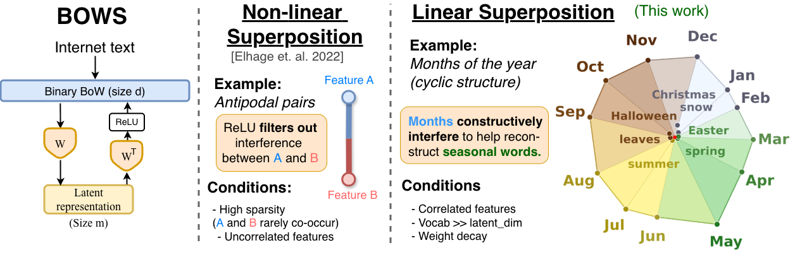

<p align="center">

  <h1 align="center"><a href="https://openreview.net/pdf?id=7akSRQS5Xh">From Data Statistics to Feature Geometry: How Correlations Shape Superposition</a></h1>
  <p align="center">
    <a href="https://safeandtrustedai.org/person/lucas-prieto/"><strong>Lucas Prieto</strong></a>
    ·
    <a href="https://stevinson.github.io/"><strong>Edward Stevinson</strong></a>
    .
    <a href="https://scholar.google.com.tr/citations?user=cmDBJlEAAAAJ&hl=en"><strong>Melih Barsbey</strong></a>
    ·
    <a href="https://pmediano.gitlab.io"><strong>Pedro A. M. Mediano</strong></a><sup>*</sup>
    ·
    <a href="https://tolgabirdal.github.io/"><strong>Tolga Birdal</strong></a><sup>*</sup>
  </p>
  <p align="center">
    <strong>Imperial College London</strong></a>
  </p>
  <p align="center">
    <strong>ILCR 2026</strong></a>
  </p>
  <div align="center">
    
  </div>

</p>


<br/>
This is the official implementation of our ICLR 2026 paper <a href="https://openreview.net/pdf?id=7akSRQS5Xh" target="_blank"><i>From Data Statistics to Feature Geometry: How Correlations Shape Superposition</i></a>. Here you can find guidance to reproduce the main results of the paper.
<br/>

## Overview

This repository accompanies the paper and contains the code used to study how data statistics shape feature geometry in superposition. The central claim of the paper is that superposition is not only about suppressing harmful interference: when features are correlated, interference can also be constructive and can organize representations into semantic clusters, cycles, and other structured arrangements.

The repository is organized around three complementary experimental settings:
- `text_bows/`: The main bag-of-words pipeline built from internet text, including dataset construction, tied-weight autoencoder training, and the plotting code used for the paper figures.
- `synthetic_bows/`: Controlled synthetic experiments for isolating how different correlation structures change the geometry learned under compression.
- `value_coding_features/`: Additional experiments on value-coding structure and tasks where geometry reflects explicit encoded values rather than only feature co-occurrence.

## Getting Started

```bash
# First install UV package manager
curl -LsSf https://astral.sh/uv/install.sh | sh
# Then install the python dependencies
uv sync
```

Each subproject has its own `README.md` file with detailed instructions and explanation. A typical workflow is:
1. Generate or download the relevant data for the subproject
2. Train the corresponding model or sweep
3. Reproduce the paper figures from the saved checkpoints


## Citation
```shell
@inproceedings{
  prieto2026correlations,
  title={Correlations in the Data Lead to Semantically Rich Feature Geometry Under Superposition},
  author={Lucas Prieto and Edward Stevinson and Melih Barsbey and Tolga Birdal and Pedro A. M. Mediano},
  booktitle={The Fourteenth International Conference on Learning Representations},
  year={2026},
  url={https://openreview.net/forum?id=7akSRQS5Xh}
}
```
