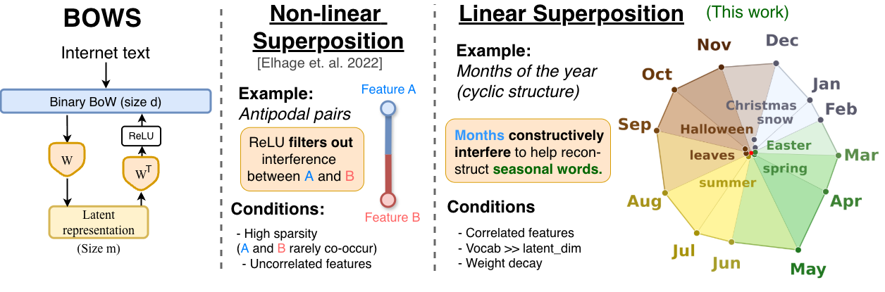

<h1 align="center">
  <a href="https://openreview.net/pdf?id=7akSRQS5Xh">From Data Statistics to Feature Geometry: How Correlations Shape Superposition</a>
</h1>

<p align="center">
  <a href="https://safeandtrustedai.org/person/lucas-prieto/"><strong>Lucas Prieto</strong></a>
  ·
  <a href="https://stevinson.github.io/"><strong>Edward Stevinson</strong></a>
  ·
  <a href="https://scholar.google.com.tr/citations?user=cmDBJlEAAAAJ&hl=en"><strong>Melih Barsbey</strong></a>
  ·
  <a href="https://tolgabirdal.github.io/"><strong>Tolga Birdal</strong></a><sup>*</sup>
  ·
  <a href="https://pmediano.gitlab.io"><strong>Pedro A. M. Mediano</strong></a><sup>*</sup>
</p>

<p align="center">
  <strong>Imperial College London</strong><br>
  <sup>*</sup>Joint senior authors
</p>

<p align="center">
  <strong>ICLR 2026</strong>
</p>

<p align="center">
  
</p>

Official implementation of our ICLR 2026 paper, [*From Data Statistics to Feature Geometry: How Correlations Shape Superposition*](https://openreview.net/pdf?id=7akSRQS5Xh). This repository provides code and instructions for reproducing the paper’s main results.

## Overview

How do data correlations shape the geometry of features represented in superposition?

We show that correlated features can produce constructive interference, giving rise to semantic clusters, cyclical structures, and other organized geometric arrangements. These findings extend the standard account of superposition, which emphasizes suppressing harmful interference.

The repository contains three complementary experimental settings:

- **[`text_bows/`](./text_bows/)** — Bag-of-words experiments using internet text, including dataset construction, tied-weight autoencoder training, and plotting code for the paper’s figures.
- **[`synthetic_bows/`](./synthetic_bows/)** — Controlled experiments that isolate how different correlation structures shape feature geometry under compression.
- **[`value_coding_features/`](./value_coding_features/)** — Experiments exploring how geometry can reflect encoded feature values, even without correlations between input features.

## Getting Started

Install [uv](https://docs.astral.sh/uv/), then install the project dependencies from the repository root:

```bash
# Install uv
curl -LsSf https://astral.sh/uv/install.sh | sh

# Install project dependencies
uv sync
```

Each subproject has its own `README.md` with detailed setup and reproduction instructions. A typical workflow is:

1. Generate or download the required data.
2. Train the model or run a hyperparameter sweep.
3. Reproduce the paper’s figures using the saved checkpoints.

## Citation

If you use this code or build on our work, please cite:

```bibtex
@inproceedings{prieto2026correlations,
  title = {From Data Statistics to Feature Geometry: How Correlations Shape Superposition},
  author = {Lucas Prieto and Edward Stevinson and Melih Barsbey and Tolga Birdal and Pedro A. M. Mediano},
  booktitle = {The Fourteenth International Conference on Learning Representations},
  year = {2026},
  url = {https://openreview.net/forum?id=7akSRQS5Xh}
}
```
